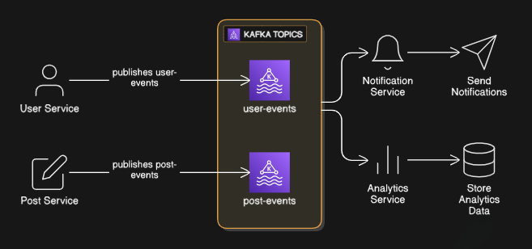

# Kafka Advanced Microservices Project

This project demonstrates an **event-driven microservices architecture** using **Apache Kafka** and **Node.js**. The system simulates real-world behavior where multiple independent services communicate via Kafka topics.

---

## 📌 Project Overview

This architecture includes:

- **User Service** – Produces user-related events (e.g., user registered)
- **Post Service** – Produces post-related events (e.g., post created)
- **Notification Service** – Consumes events and triggers notifications
- **Analytics Service** – Consumes events and logs data for analytics
- **Kafka Broker** – Manages communication between services using topics

All communication between services happens through Kafka topics, ensuring the system is **scalable, decoupled, and fault-tolerant**.

---

## 🖼 Architecture Diagram

Below is the architecture diagram for the project:



---

## 📁 Folder Structure

```
kafka-advanced/
│
├── docker-compose.yml
│
├── user-service/
│     ├── index.js
│     ├── producer.js
│     └── package.json
│
├── post-service/
│     ├── index.js
│     ├── producer.js
│     └── package.json
│
├── notification-service/
│     ├── index.js
│     ├── consumer.js
│     └── package.json
│
└── analytics-service/
      ├── index.js
      ├── consumer.js
      └── package.json
```

---

## 🚀 Features

- Event-driven architecture
- Microservices built using Node.js
- Kafka producers & consumers
- Decoupled communication between services
- Real-world style event workflow (User → Post → Notifications → Analytics)
- Docker-based Kafka setup

---

## 🛠 Technologies Used

- **Node.js**
- **KafkaJS** (Kafka client for Node.js)
- **Apache Kafka**
- **Docker & Docker Compose**

---

## 📦 Installation & Setup

### 1️⃣ Clone the repository

```
git clone https://github.com/your-repo/kafka-advanced.git
cd kafka-advanced
```

### 2️⃣ Start Kafka using Docker

```
docker-compose up -d
```

Kafka will now be running at:

- **Broker:** localhost:9092
- **Zookeeper:** localhost:2181

---

## ▶ Running Each Service

### Notification Service (Consumer)

```
cd notification-service
node index.js
```

### Analytics Service (Consumer)

```
cd analytics-service
node index.js
```

### User Service (Producer)

```
cd user-service
node index.js
```

### Post Service (Producer)

```
cd post-service
node index.js
```

---

## 📩 Example Event Flow

1. User Service publishes `USER_REGISTERED` to `user-events`
2. Post Service publishes `POST_CREATED` to `post-events`
3. Notification Service consumes both topics and sends appropriate alerts
4. Analytics Service logs both events for processing

---

## 📊 Output Example

**Notification Service:**

```
Notification Service Received: { userId: 'u101', action: 'USER_REGISTERED' }
Send Welcome Message to: Chatanya
```

**Analytics Service:**

```
Analytics Received: { topic: 'post-events', data: {...} }
```

---

## 🧩 Extend This Project

You can extend this system with:

- MongoDB for persistent storage
- Kafka Streams for real-time processing
- Redis caching layer
- WebSockets for real-time UI updates
- Next.js dashboard for analytics visualization

---

## ✨ Author

**Chatanya**
